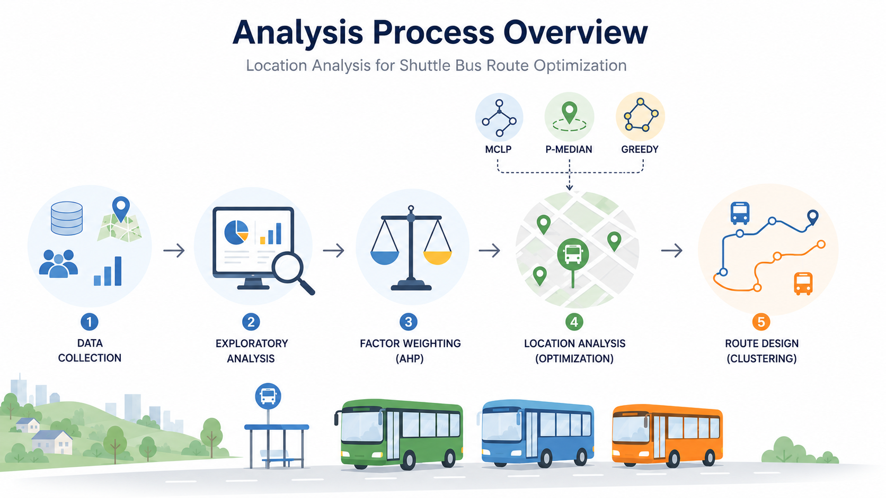
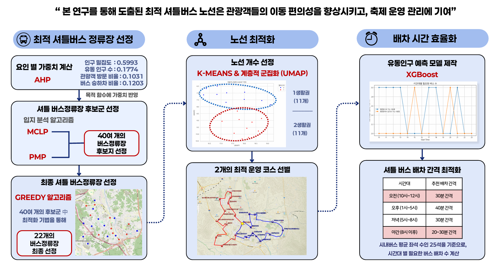
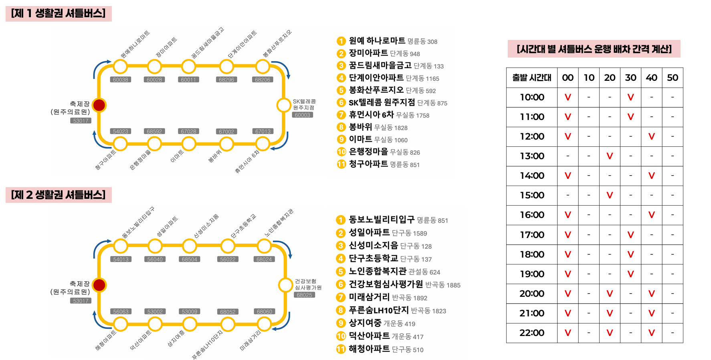

# Location-Allocation-Based Shuttle Bus Route and Headway Optimization for a Regional Festival

🏆 **Excellence Award, 2024 BIG CONTEST**

<br>

This project develops a data-driven shuttle bus planning framework to address traffic congestion, parking shortages, and limited accessibility during a regional festival.

The framework integrates location-allocation models, route clustering, and passenger demand forecasting to optimize shuttle stop locations, operating routes, and time-based headways.

<br>

[📊 Analysis Results](research_results.md)  
[📑 Presentation Slides](bigcontest-presentation.pdf)

<br>

---

## 💡 Project Motivation

Regional festivals attract large numbers of visitors within a limited time and area, often causing traffic congestion and parking shortages.


<p align="center">
  
</p>

<br>

Exploratory analysis showed that visitor mobility increased sharply during the festival period and that private vehicles accounted for a high proportion of travel. These findings indicated the need for a temporary shuttle bus network based on actual mobility patterns and transportation demand.


---

## 🎯 Project Objective

- Select shuttle bus stops that maximize passenger-demand coverage
- Minimize the distance between demand areas and selected shuttle stops
- Organize the selected stops into efficient operating routes
- Estimate time-based passenger demand and determine appropriate shuttle headways

<br>

---


## 🗂️ Analysis Procedure

The analysis combines location weighting, stop selection, route clustering, and demand forecasting to develop an integrated shuttle bus operation plan for a regional festival.

<br>

<p align="center">
  
</p>

<br>

---

## 📚 Data Sources

- <code>SKT Mobility Data</code> Administrative-district OD and stay-population data used to analyze visitor movement and time-based demand
- <code>Local Government Open Data</code> Population, bus stop, tourist-attraction, and administrative-area data used to evaluate candidate locations
- <code>Transportation Card Big Data System</code> Stop-level boarding and alighting data used to measure public transportation demand
- <code>Ministry of Land, Infrastructure and Transport</code> Administrative boundaries and cadastral data used for GIS-based distance and coverage analysis
- <code>Ministry of the Interior and Safety</code> Administrative-district codes used to integrate datasets
- <code>Regional Economy Portal</code> Festival-related social text data used to examine perceptions of shuttle and parking services

  
<br>


---


## 🔍 Methodology


<p align="center">
  
</p>


### 📍 MCLP 

The **Maximal Covering Location Problem** selects a limited number of shuttle stops while maximizing weighted demand covered within a **400 m service radius**.
The model was used to identify locations capable of serving the largest possible number of potential passengers.

<br>


### 📍 P-Median 


The **P-Median model** selects a fixed number of shuttle stops while minimizing the total weighted distance between demand points and their assigned stops.
The objective function was modified to jointly consider access distance and AHP-based location importance.


<br>


---

## 📊 Results

The final framework selected **22 shuttle stops** and organized them into **two routes** serving different areas around the festival venue.

It also proposed time-based headways based on predicted passenger demand.


<br>

<p align="center">
  
</p>

---

## 📁 Repository Structure

```
shuttle-stop-location-analysis/
├── README.md
├── requirements.txt
├── .gitignore
├── config/
│   └── location_pipeline.example.yaml  
├── data/
│   ├── make_sample_data.py              
│   ├── generate_candidate_stops.py      
│   └── *.csv                            
├── src/
│   ├── 00_preprocessing.py            
│   ├── distance_utils.py             
│   ├── validation.py                  
│   ├── 01_mclp_location_selection.py   
│   ├── 02_pmedian_location_selection.py 
│   ├── 03_merge_location_candidates.py  
│   ├── 04_greedy_candidate_reconciliation.py  
│   └── run_location_pipeline.py      
└── tests/                          
```
