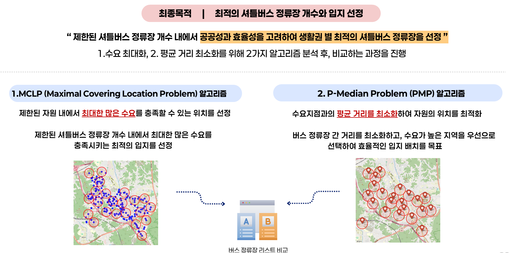
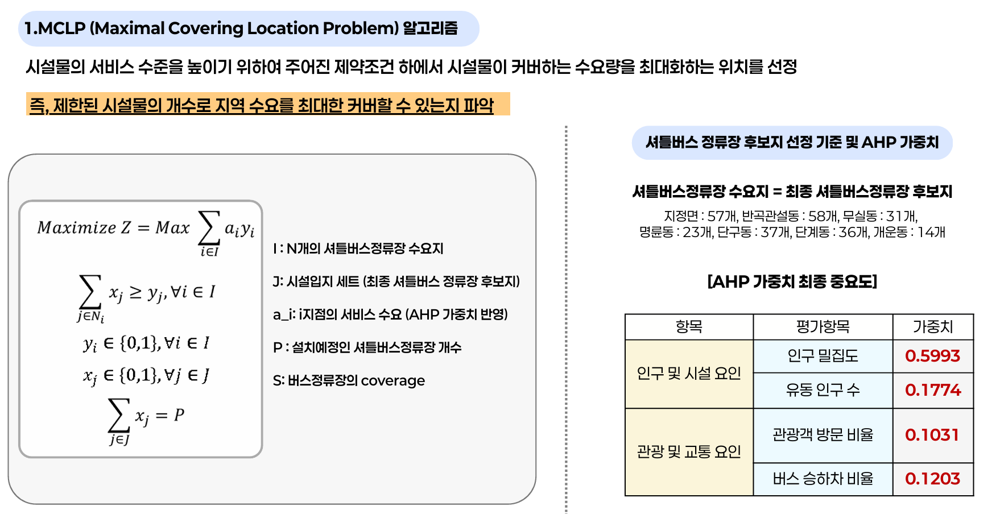
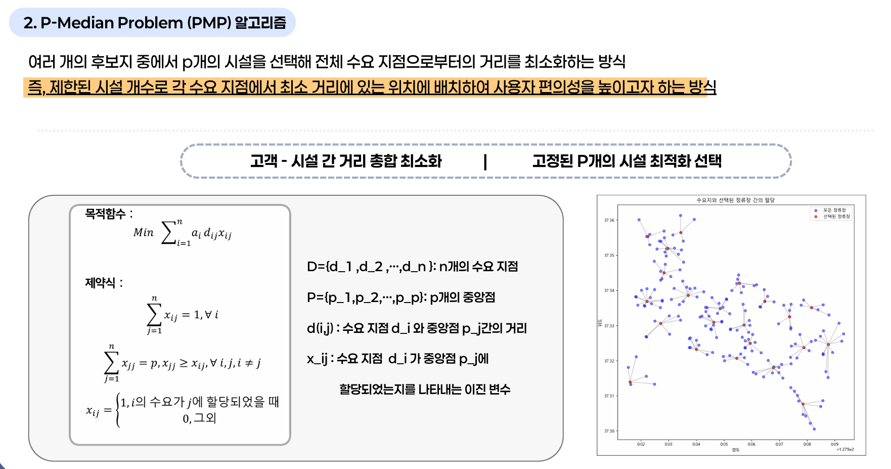
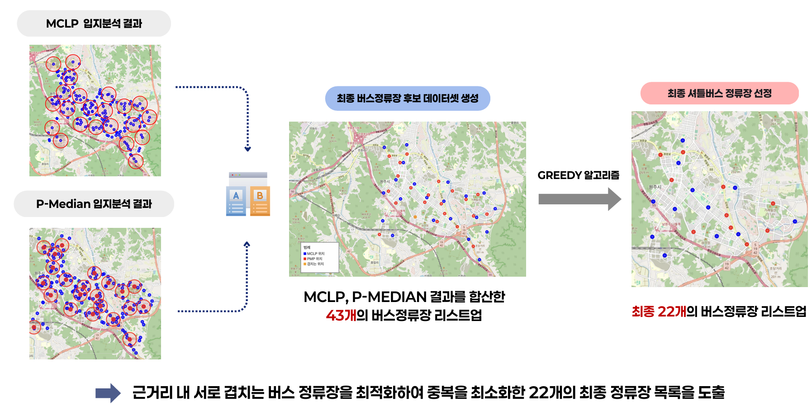
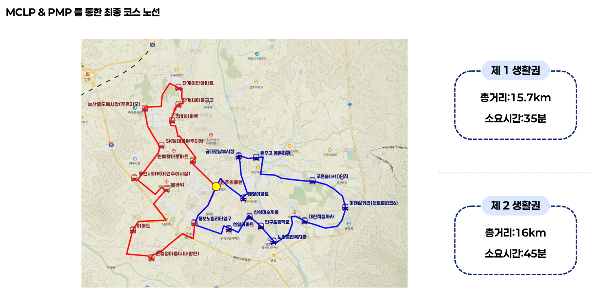

# Project Results

This project developed a data-driven shuttle bus operating plan to reduce traffic congestion during the Wonju Dancing Carnival.

AHP was used to construct demand weights, while **MCLP** and **P-Median** were applied to evaluate public coverage and travel efficiency. The outputs of both models were then merged, and a Greedy Algorithm was used to remove redundant stops and derive the final shuttle stop and route plan.

 

---

## 1. Analysis Pipeline

This project developed a data-driven shuttle bus operating plan to reduce traffic congestion during a local festival.

The analysis followed an end-to-end pipeline, from identifying spatial demand to selecting shuttle stops and designing operational routes.

  

 

---

## 2. Shuttle Stop Location Selection

Two location optimization models were applied to balance **demand coverage** and **user accessibility** within a limited number of shuttle stops.

 

  

 

### 📍 MCLP

MCLP incorporated AHP-based demand weights and selected stops that **maximized weighted demand coverage within a 400 m service radius**.

 

  

 

### 📍 P-Median

P-Median assigned each demand point to a selected stop and **minimized the total demand-weighted travel distance** between demand points and shuttle stops.

 

  

 

---

## 3. Candidate Integration and Final Stop Selection

The MCLP and P-Median outputs were combined into a dataset of **43 candidate shuttle stops**.

Candidates were ranked using AHP scores, demand coverage, distance efficiency, and whether they were selected by both models. A Greedy Algorithm then reduced spatial overlap and selected the final **22 shuttle stops**, balancing accessibility and operational efficiency.

  

 

---

## 4. Shuttle Bus Route Design

The final stops were grouped according to service zones and spatial connectivity, resulting in **two circular shuttle bus routes** centered on the festival venue.

- **Service Zone 1 Route:** Covers the western and northwestern areas of Wonju, totaling 15.7 km
- **Service Zone 2 Route:** Covers the eastern and southeastern areas of Wonju, totaling 16 km

The two routes connect all 22 selected stops while maintaining accessibility to the festival venue and minimizing unnecessary travel.

  

 

---

## 5. Time-Based Headway Plan

Instead of using a fixed schedule, the project proposed **flexible shuttle headways based on expected demand by time period**.

Headways were shortened during peak demand periods and extended during lower-demand periods. This strategy was designed to reduce passenger waiting time while minimizing unnecessary vehicle operations.

  

 
